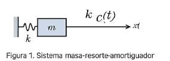
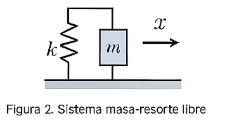

# Sistemas Mecánicos
Los sistemas mecánicos son fundamentales en la ingeniería, ya que permiten analizar y diseñar mecanismos utilizados en diversas industrias. Estos sistemas pueden modelarse mediante ecuaciones diferenciales, las cuales describen su comportamiento dinámico en función de las fuerzas aplicadas y sus propiedades físicas. En esta clase, exploraremos la modelación de sistemas mecánicos, los elementos que los componen y su análisis mediante métodos matemáticos.
## 1.  Conceptos Fundamentales
🔑 Sistema mecánico:

Conjunto de elementos físicos interconectados que transmiten movimiento y fuerza.

🔑 Ecuación diferencial:

Expresión matemática que describe la relación entre una función y sus derivadas.

🔑 Grado de libertad (DOF):

Número mínimo de coordenadas independientes necesarias para describir el movimiento de un sistema.

🔑 Sistema masa-resorte-amortiguador:

Modelo físico que describe la oscilación de un sistema mecánico compuesto por una masa, un resorte y un amortiguador.

## 2. Modelado de Sistemas Mecánicos
El modelado matemático de un sistema mecánico se basa en las leyes de Newton y en los principios de la dinámica. En general, estos sistemas están compuestos por:

Masa $(m)$: Representa la inercia del sistema.

Resorte $(k)$: Modela la elasticidad del sistema según la Ley de Hooke.

Amortiguador $(b)$: Simula la fricción y disipación de energía.

### 2.1. Ecuación del Sistema Masa-Resorte-Amortiguador

Para un sistema compuesto por una masa, un resorte y un amortiguador, la ecuación diferencial se expresa como:

$$m\frac{d^{2}x}{dt^{2}}+b\frac{dx}{dt}+kx=F(t)$$

Donde:

$x$ es el desplazamiento,

$m$ es la masa,

$b$ es el coeficiente de amortiguamiento,

$k$ es la constante del resorte,

$F(t)$ es la fuerza aplicada.

### 2.2. Tipos de Sistemas Mecánicos

-Existen distintos tipos de sistemas mecánicos según sus características dinámicas:

-Sistemas sin amortiguamiento: Movimiento oscilatorio sin disipación de energía.

-Sistemas subamortiguados: Oscilaciones con disipación progresiva de energía.

-Sistemas críticamente amortiguados: Retorno a la posición de equilibrio sin oscilaciones.

-Sistemas sobreamortiguados: Movimiento hacia el equilibrio sin oscilaciones, pero más lento que en el caso crítico.

## 3. Análisis de Respuesta de Sistemas Mecánicos
El análisis de un sistema mecánico se basa en su respuesta al aplicar una fuerza externa. Las soluciones de la ecuación diferencial dependen de las condiciones iniciales y de la naturaleza de la fuerza aplicada.
### 3.1. Movimiento Libre
Si no hay una fuerza externa actuando sobre el sistema $(F(t)=o)$, la ecuación diferencial se resuelve considerando únicamente las condiciones iniciales.
### 3.2. Movimiento Forzado
Si el sistema está sometido a una fuerza externa $F(t)$, su respuesta puede dividirse en:

-Respuesta transitoria: Depende de las condiciones iniciales y desaparece con el tiempo.

-Respuesta en estado estable: Es la parte de la solución que permanece en el tiempo.

## 4.💡 Ejemplo 1: Sistema Masa-Resorte-Amortiguador con Fuerza Externa



📌 Enunciado:
Un sistema mecánico tiene:

Masa $𝑚=2$

kg $m=2kg$

Amortiguador $𝑏=3Ns/m$

Resorte $k=5N/m$

Fuerza externa $F(t)=10cos(2t)$

✏️ Ecuación diferencial: $2x¨+3x˙+5x=10cos(2t)$

🧮 Código en MATLAB:

```
m = 2; b = 3; k = 5;
syms x(t)
Dx = diff(x, t);
D2x = diff(Dx, t);
F = 10*cos(2*t);

eq = m*D2x + b*Dx + k*x == F;
xSol = dsolve(eq)

disp('Solución del sistema:')
pretty(xSol)
```

💡 Ejemplo 2: Sistema Masa-Resorte sin Amortiguador (Movimiento libre)

📌 Enunciado:
El sistema tiene:

Masa $m=1.5kg$

Constante del resorte $k=4N/m$

Sin amortiguador ni fuerza externa

✏️ Ecuación diferencial:
$$\ddot{x}+\frac{4}{1.5}x=0\to \ddot{x}+2.67x=0$$

🧠 Frecuencia natural:
$$Wn=\sqrt{\frac{k}{m}}=\sqrt{\frac{4}{1.5}}=1.63 rad/s$$

📌 Solución general:
$$x(t)=C1cos(1.63t)+C2sin(1.63t)$$

🧮 Código en MATLAB:

```
m = 1.5; k = 4;
syms x(t)
Dx = diff(x, t);
D2x = diff(Dx, t);

eq = m*D2x + k*x == 0;
xSol = dsolve(eq)

disp('Solución del sistema libre:')
pretty(xSol)
```
## 6. Ejecicios 
### Ejercicio 1
Determinar la posición de equilibrio y la frecuencia angular del sistema de resorte, masa y polea mostrados. El resorte tiene una constante $k$, y la polea puede considerarse como desprovista de fricción y de masa despreciable.

En el equilibrio, sobre la masa m actúa su peso hacia abajo, y la tensión de la cuerda hacia arriba. Por tanto, la condición de equilibrio para la masa $m$ es:

$$mg=T$$

Sobre la polea actúa la tensión de la cuerda hacia abajo, dos veces, una por cada lado de la polea, y la fuerza elástica del muelle, hacia arriba. Si $L$ es la longitud del muelle en el estado de equilibrio, y $L$0 su longitud natural, la condición de equilibrio para la polea es:

$$2t=k(L-L_{0})$$

Con estas dos ecuaciones, se deduce que:

$$L=L_{0}+2\frac{mg}{k}$$

Una vez establecido el equilibrio, desplazamos la masa $m$ una distancia vertical y hacia abajo, dejándola en libertad. La ecuación de movimiento para la masa $m$ es:

$$m\frac{d^{2}y}{dt^{2}}=-\grave{T}$$

donde $\grave{T}$ es la tensión de la cuerda menos su valor en el equilibrio $T$. Fijándonos ahora en la polea vemos que si la masa se desplaza una distancia y hacia abajo, el muelle debe alargarse una distancia $y/2$ respecto de su posición de equilibrio. Como la polea no tiene masa, su ecuación de movimiento es:

$$2\grave{T}=k\frac{y}{2}$$

de donde obtenemos

$$\grave{T}=k\frac{y}{4}$$

con lo cual, la masa $m$ realiza el movimiento:

$$m\frac{d^{2}t}{dt^{2}}=-k\frac{y}{4}$$

 que es un MAS,

 $$\frac{d^{2}t}{dt^{2}}+\frac{k}{4m}y=0$$

 de frecuencia:

 $$\omega =\sqrt{\frac{k}{4m}}$$

 ### Ejercicio 2

Determinar la posición de equilibrio y la frecuencia angular del sistema de masa única mostrado. La masa de la polea es despreciable.


## 7. Tablas
Para organizar información sobre parámetros de sistemas mecánicos:
 

|     **Parametro**     | **Simbolo** | **unidad** |
|-----------------------|-------------|------------|
|          Masa         |     $m$     |    $kg$    |
|    Amortiguamiento    |     $b$     |   $Ns/m$   |
|Constante del resorte  |     $k$     |   $N/m$    |

Tabla 1. Parámetros de un sistema mecánico.


## 8. Código
Teniendo en cuenta que el curso requiere del desarrollo de código matlab, c, c++ u otro. Si requiere incluir pequeños segmentos de código en los apuntes hágalos de la siguiente manera:

💡**Ejemplo 4:**
```
var sumar2 = function(numero) {
  return numero + 2;
}
```

## 9. Conclusiones

-El análisis de sistemas mecánicos permite comprender su dinámica y respuesta a fuerzas externas.

-El modelo matemático se basa en ecuaciones diferenciales aplicando las leyes de Newton y Hooke.

-MATLAB y la transformada de Laplace facilitan la resolución de estos sistemas.

## 10. Referencias

-Ogata, K. (1987). Dinámica de sistemas. Prentice Hall.

-Chen, C. (1993). Analog and Digital Control System Design. Saunders College Publishing.

-https://www.dfmf.uned.es/~aperea/material_docente/MyO/tema5_2.pdf

-MATLAB Documentation: mathworks.com
